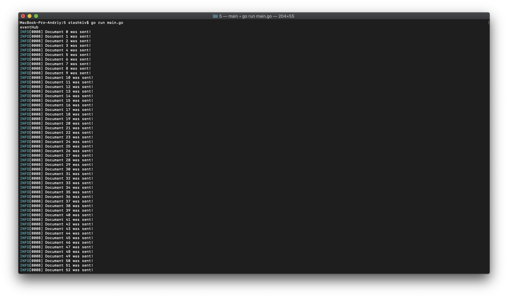

# Підготовка Azure

1. Знаходимо в Azure і шукаємо Resource Group. Створюємо нову групу. Бажаний регіон –  West Europe.


3. Шукаємо Azure Cache for Redis. Створюємо новий. Resource Group – вибираємо групу створену в попередньому пункті. Очікуємо створення і статусу "Running"


4. Шукаємо Event Hubs. Створюємо новий. Вибираємо Resource Group створену в першому пункті.


5. Заходимо в створений в попередньому пункті Event Hub. Додаємо новий Instance.

6. Заходимо в Entities –> Event Hubs і вибираємо створений в попередньому пункті Instance.

7. Вибираємо Shared access policies та створюємо новий. При створенні вибирається параметр Manage.


# Запуск проекту

1. Встановлюємо Go на комп'ютер, якщо його ще немає – https://golang.org/doc/install?download=go1.15.6.darwin-amd64.pkg

2. В файлі go.main заміняємо дані на свої з Azure
* eventHubConnStr – Connection string–primary key вашого EventHub
* redisAddr – адресу Azure Cache for Redis
* redisPass – Primary

3. Run проекту ` go run main.go `


# Запис даних

1. Для запису даних в Event Hub або Redis, необхідно виконати POST запит на localhost:9000/api

2. Виконуємо запит через Postman. Content-Type – application/json.
Формат Body:
```
{
 "url": "JsonLink",
 "strategy": "eventHub/redis"
}
```

*  JsonLink замінити на необхідне посилання json-файлу
*  JsonLink замінити на необхідне посилання json-файлу


Для EventHub:


Для Redis:


3. Перевіряємо чи дані записались в Event Hub.
В Azure вибираємо створений Event Hub -> Features –> Proccess Data –> Explore


4. Перевіряємо чи дані записались в redis.
В Azure вибираємо створений Redis Chache -> Console > команда hgetAll ім'я каталогу, який ми вказували, як значення MAP_NAME у файлі проекту SendDataConsoleImpl.java


