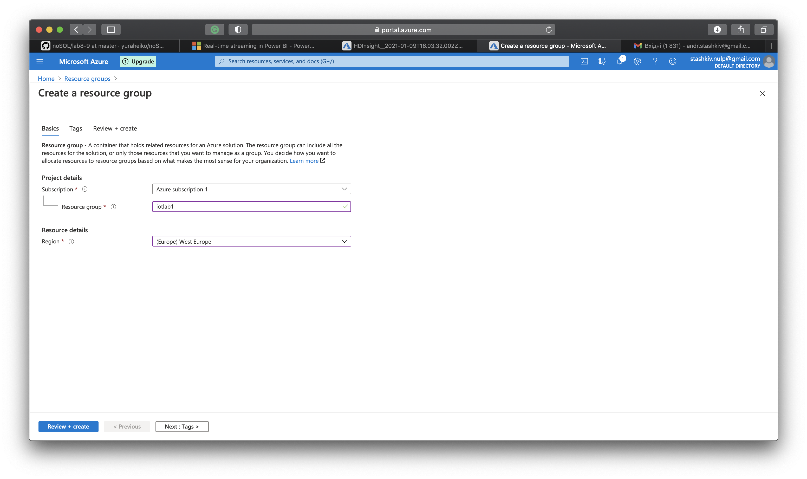
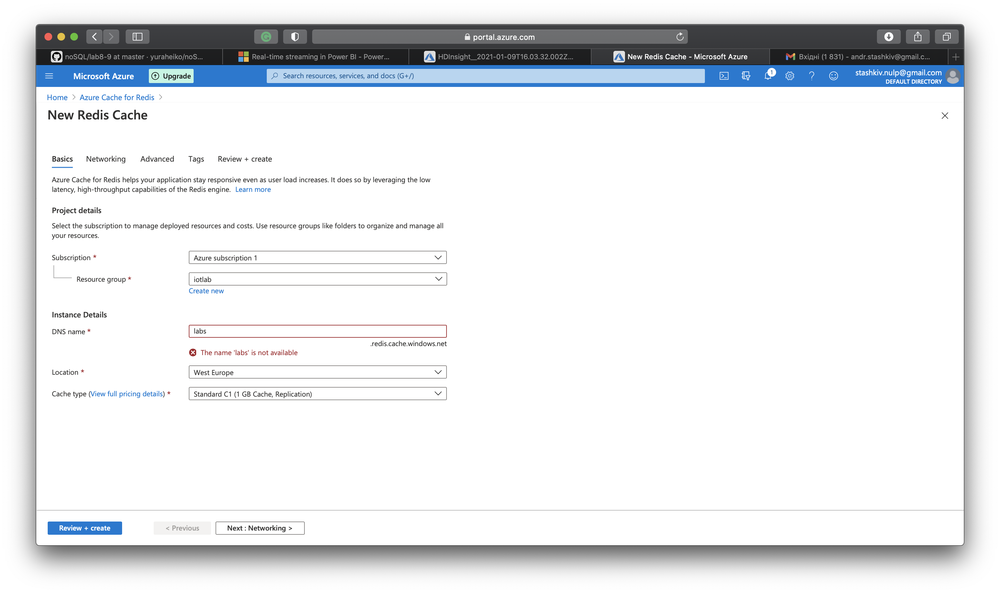
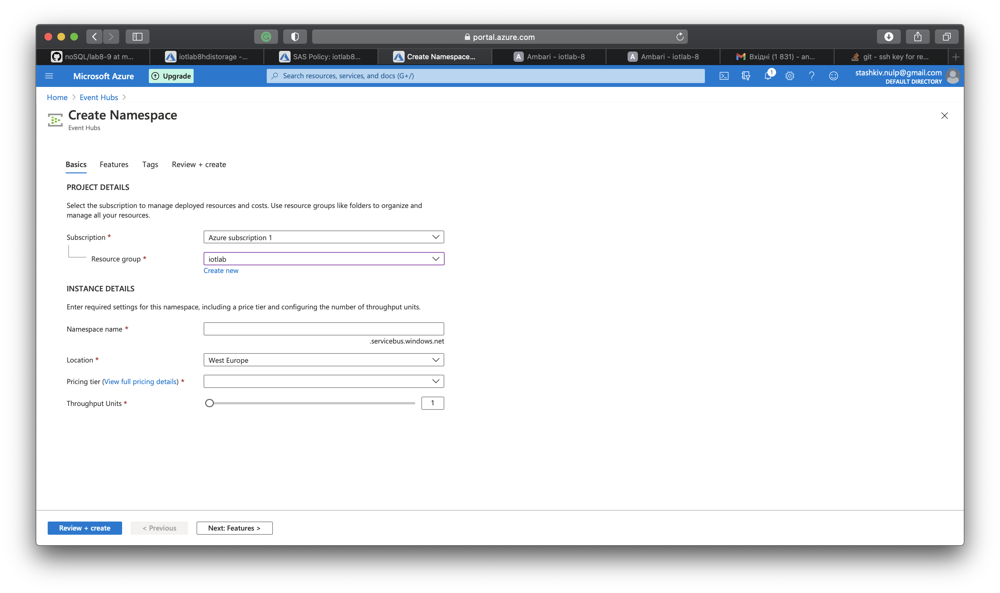
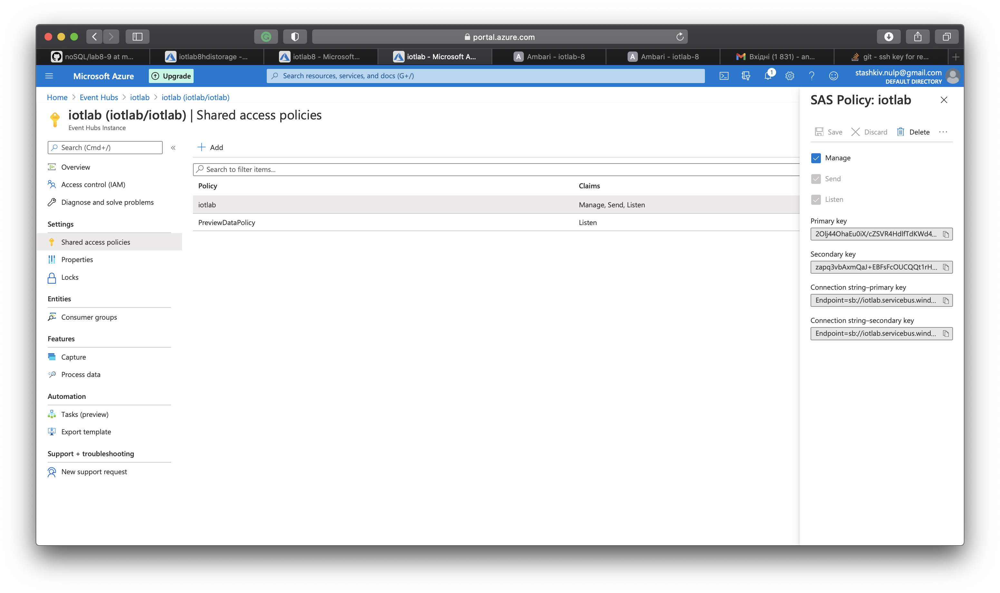
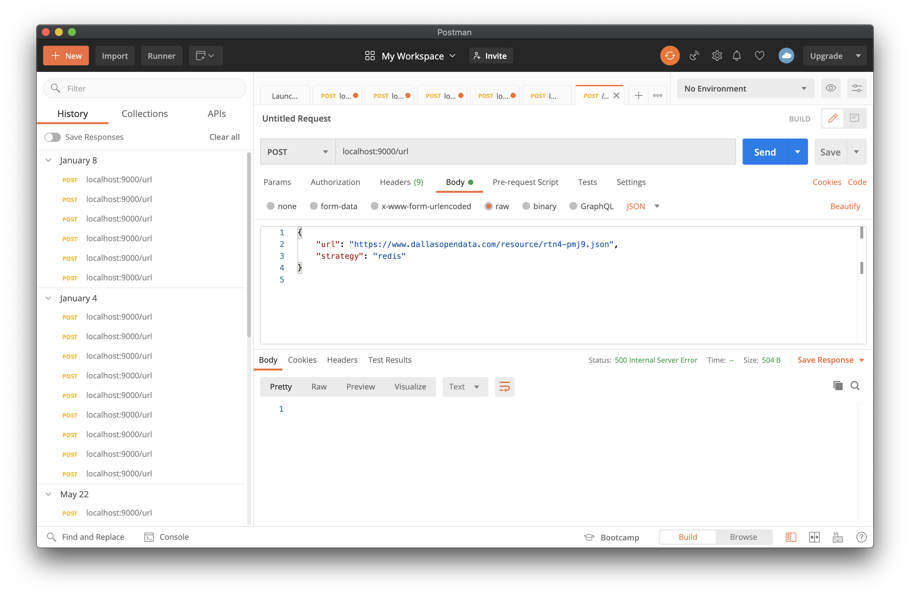
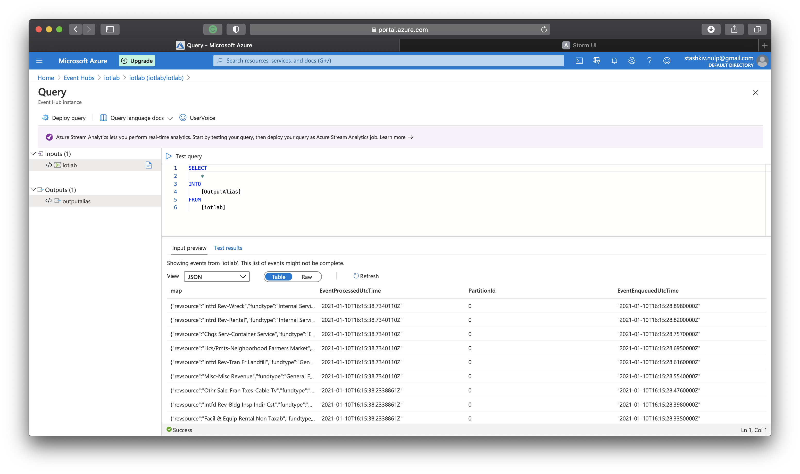
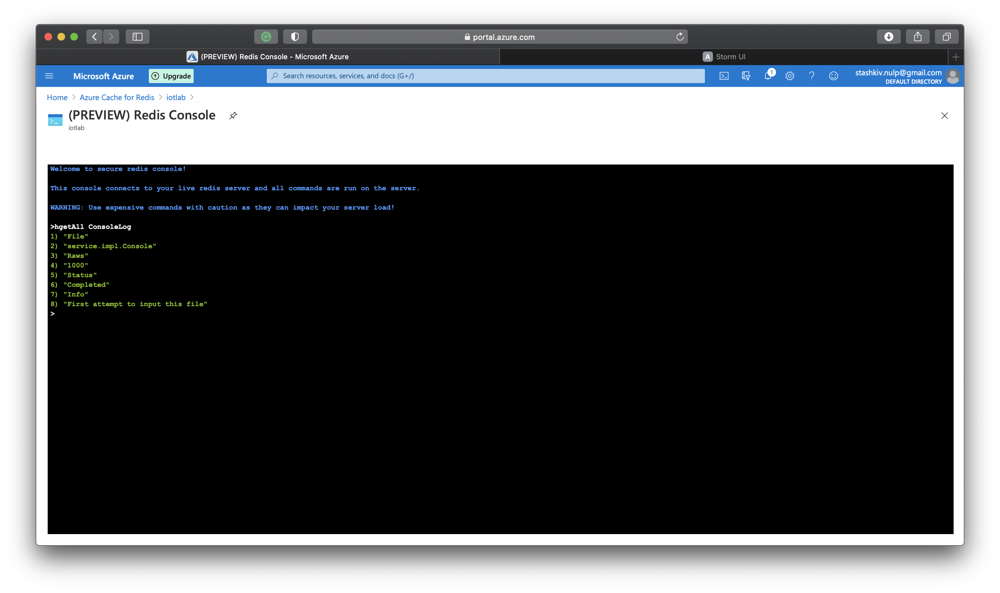

# Підготовка Azure

1. Знаходимо в Azure і шукаємо Resource Group. Створюємо нову групу. Бажаний регіон –  West Europe.



3. Шукаємо Azure Cache for Redis. Створюємо новий. Resource Group – вибираємо групу створену в попередньому пункті. Очікуємо створення і статусу "Running"



4. Шукаємо Event Hubs. Створюємо новий. Вибираємо Resource Group створену в першому пункті.



5. Заходимо в створений в попередньому пункті Event Hub. Додаємо новий Instance.

6. Заходимо в Entities –> Event Hubs і вибираємо створений в попередньому пункті Instance.

7. Вибираємо Shared access policies та створюємо новий. При створенні вибирається параметр Manage.



# Кастомізація проекту

1. В папці Service в файлі SendDataConsoleImpl.java заміняємо CACHE_HOSTNAME, CACHE_KEY на відповідні дані з Azure.

2. В папці Service в файлі SendDataEventHubImpl.java заміняємо CACHE_HOSTNAME, CACHE_KEY, namespace, hub name, Connection string–primary key, Primary key на відповідні з Azure.

3. Build проекту

# Запис даних

1. Для запису даних в Event Hub або Redis, необхідно виконати POST запит на localhost:9000/api

2. Виконуємо запит через Postman. Content-Type – application/json.
Формат Body:
```
{
 "url": "JsonLink",
 "strategy": "eventHub/redis"
}
```

*  JsonLink замінити на необхідне посилання json-файлу
*  JsonLink замінити на необхідне посилання json-файлу



3. Перевіряємо чи дані записались в Event Hub.
В Azure вибираємо створений Event Hub -> Features –> Proccess Data –> Explore



4. Перевіряємо чи дані записались в redis.
В Azure вибираємо створений Redis Chache -> Console > команда hgetAll ім'я каталогу, який ми вказували, як значення MAP_NAME у файлі проекту SendDataConsoleImpl.java


